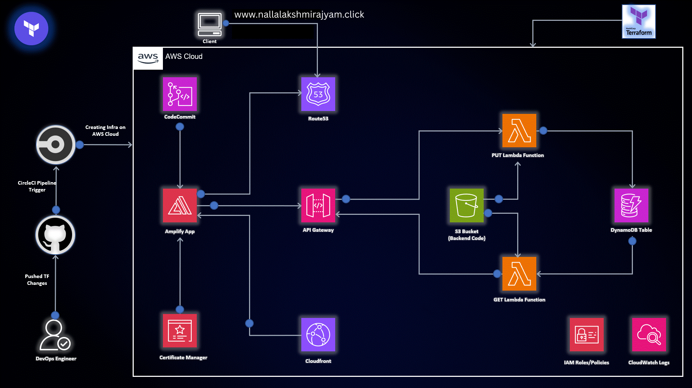
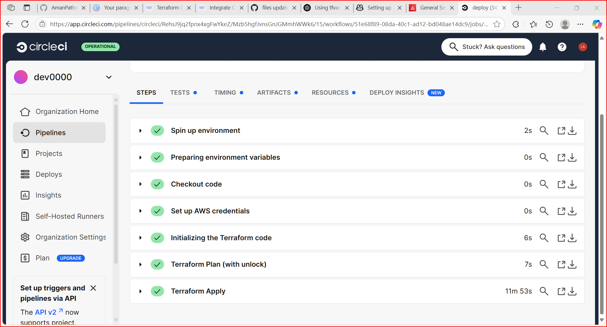
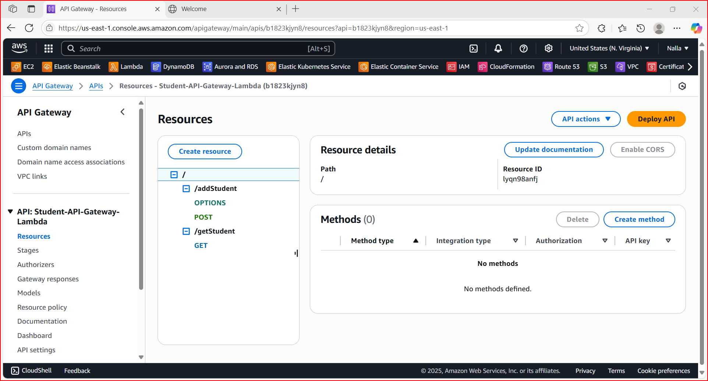
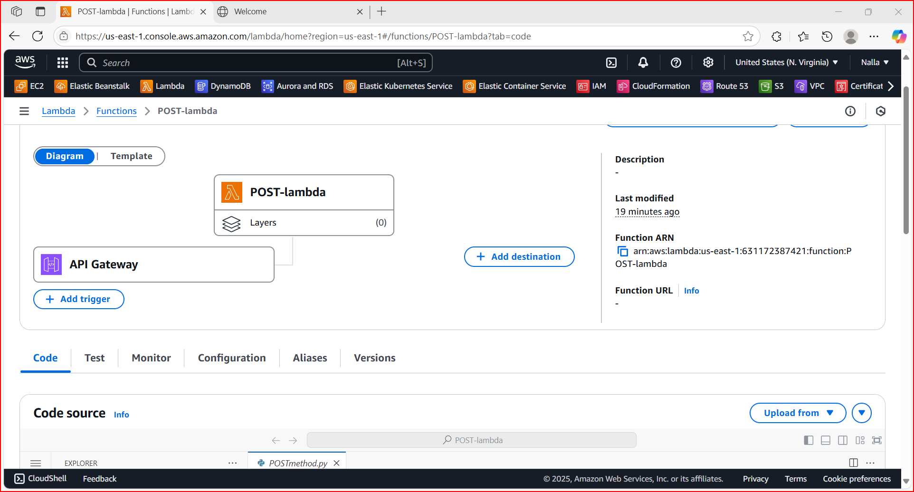
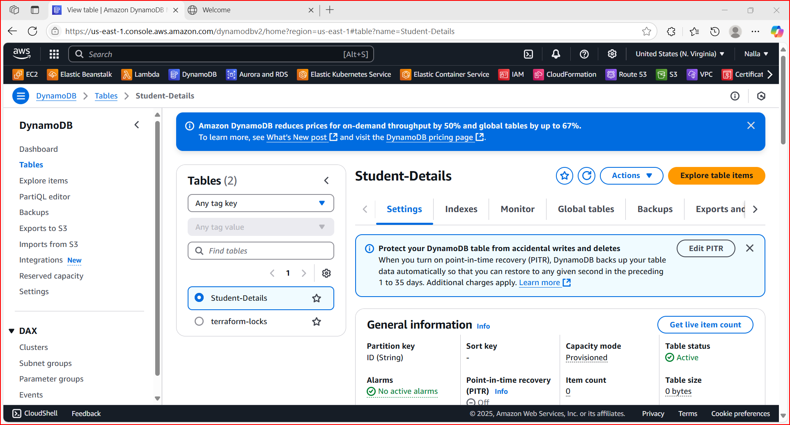
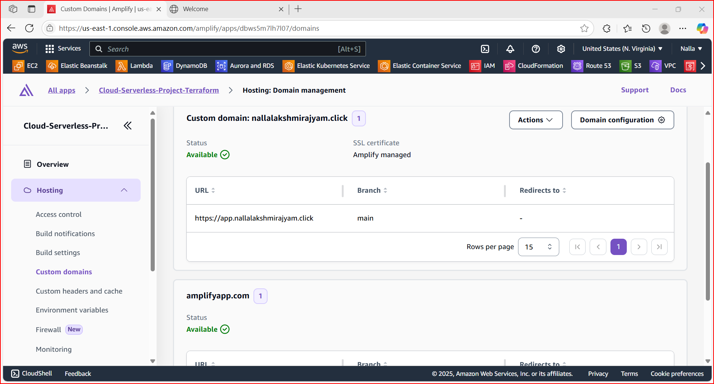
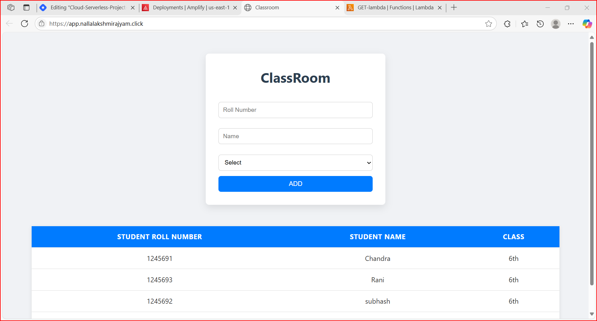
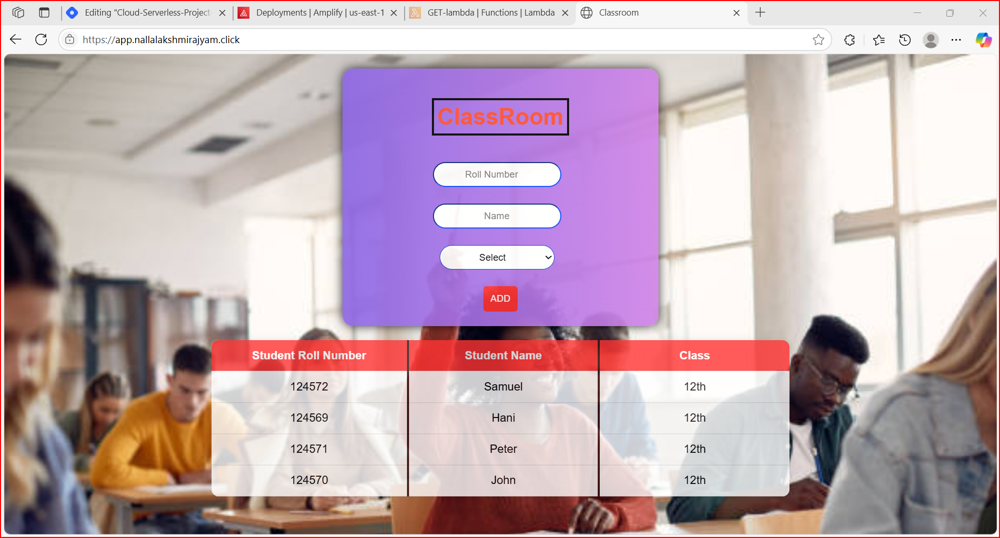
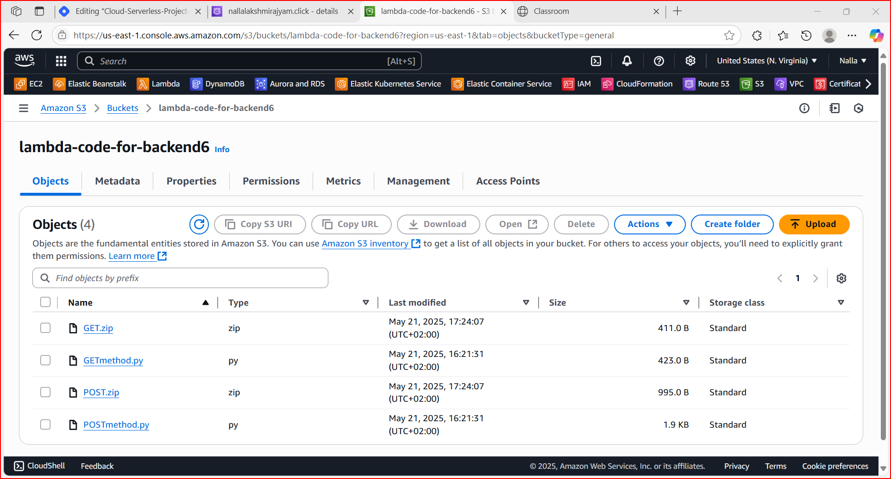

# ☁️ Cloud-Serverless-Ecommerce – Full Stack Serverless Project on AWS

## 🧾 Project Overview

This is a fully serverless, scalable, and cost-effective **E-commerce application** built using AWS Serverless technologies. It demonstrates a complete end-to-end integration of a React frontend with backend microservices on AWS using **Lambda, DynamoDB, API Gateway**, and **Terraform** for provisioning.

The project is modular, automated, and designed for real-world cloud-native deployments following best practices.

## Images recorded while doing this project

## ✨ Key Features

- 🖥️ **Frontend** built using ReactJS hosted on S3 + CloudFront
- ⚙️ **Backend** powered by AWS Lambda with Python
- 🔌 **API Gateway** for secure and managed API routing
- 🧠 **Microservices Architecture**: Product, Cart, Order, Search
- 🛡️ Authentication with **Amazon Cognito**
- 📦 **DynamoDB** as NoSQL database for high performance
- 🔍 **OpenSearch** for product search and indexing
- 📬 Event-driven architecture with **SQS & EventBridge**
- 💳 Stripe integration for real-time payment processing
- ☁️ **Terraform** used to provision the complete infrastructure

---

## 🔧 Tech Stack

| Category      | Technology                      |
|---------------|----------------------------------|
| Frontend      | ReactJS, AWS S3, CloudFront      |
| Backend       | Python, AWS Lambda               |
| API Gateway   | Amazon API Gateway               |
| Authentication| Amazon Cognito                   |
| Database      | Amazon DynamoDB                  |
| Eventing      | Amazon EventBridge, SQS          |
| Search        | Amazon OpenSearch                |
| Payments      | Stripe                           |
| IaC           | Terraform                        |
| Monitoring    | CloudWatch, X-Ray                |

---
## 📖 Detailed Guide

For a full step-by-step tutorial on how I built and deployed this serverless project using AWS and Terraform, please refer to my blog post:

👉 [Read the full blog here]( https://blog.nallalakshmirajyam.click/building-a-full-stack-serverless-web-application-on-aws-with-terraform-and-circleci)

It explains the architecture, tools used, Terraform deployment, and hands-on process in detail.

